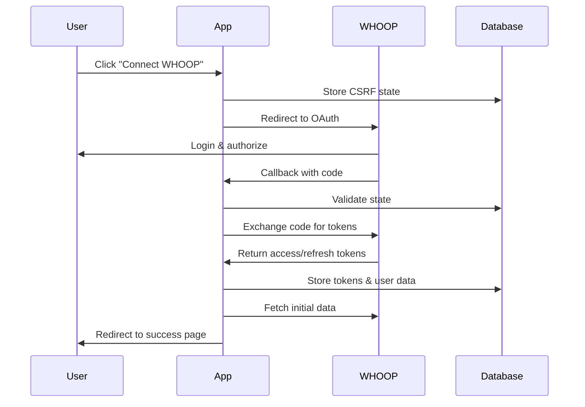

# WHOOP Integration Guide

This comprehensive guide explains how to set up and use the WHOOP API v2 integration in your Uara.ai application for collecting health and fitness data.

## Table of Contents

1. [Overview](#overview)
2. [Prerequisites](#prerequisites)
3. [Setup Process](#setup-process)
4. [Configuration](#configuration)
5. [Database Schema](#database-schema)
6. [API Endpoints](#api-endpoints)
7. [Authentication Flow](#authentication-flow)
8. [Data Synchronization](#data-synchronization)
9. [Webhook Implementation](#webhook-implementation)
10. [Frontend Integration](#frontend-integration)
11. [Testing](#testing)
12. [Production Deployment](#production-deployment)
13. [Security Considerations](#security-considerations)
14. [Troubleshooting](#troubleshooting)
15. [Data Privacy & HIPAA Compliance](#data-privacy--hipaa-compliance)

## Overview

The WHOOP integration allows users to connect their WHOOP fitness tracker to Uara.ai for comprehensive health data analysis. This integration provides:

- **Real-time health metrics**: Recovery scores, HRV, sleep data, strain, and workouts
- **OAuth 2.0 authentication**: Secure user authorization flow
- **Webhook support**: Live data updates when new WHOOP data is available
- **HIPAA-compliant storage**: Encrypted health data storage with proper access controls
- **Data synchronization**: Manual and automatic data syncing capabilities

### Key Features

✅ **WHOOP API v2 Integration** - Full support for latest WHOOP API
✅ **OAuth 2.0 Flow** - Secure authentication with CSRF protection
✅ **Real-time Webhooks** - Live updates when new data is available
✅ **Comprehensive Data Types** - Recovery, cycles, sleep, workouts, body measurements
✅ **Token Management** - Automatic token refresh and error handling
✅ **Data Disconnect** - Users can disconnect and optionally preserve data
✅ **TypeScript Support** - Full type safety throughout the integration
✅ **Prisma Integration** - Database operations with WorkOS authentication

## Prerequisites

### WHOOP Developer Account

- Active WHOOP account
- WHOOP Developer Portal access
- WHOOP device with data (for testing)

### Technical Requirements

- Node.js 18+ with Bun package manager
- PostgreSQL database
- Prisma ORM configured
- WorkOS authentication setup
- HTTPS domain (required for production webhooks)

### Environment Setup

- Next.js 14+ with App Router
- TypeScript configuration
- Tailwind CSS (for UI components)

## Setup Process

### 1. WHOOP Developer Portal Setup

1. **Register Your Application**

   ```
   1. Go to https://developer.whoop.com
   2. Create a developer account or sign in
   3. Create a new application
   4. Note your Client ID and Client Secret
   ```

2. **Configure OAuth Settings**

   ```
   Application Name: Uara.ai Health Platform
   Description: Longevity and health optimization platform

   Redirect URIs:
   - Development: http://localhost:3000/api/wearables/whoop/callback
   - Production: https://yourdomain.com/api/wearables/whoop/callback

   Required Scopes:
   - read:recovery (Recovery data)
   - read:cycles (Daily physiological cycles)
   - read:workout (Workout data)
   - read:sleep (Sleep data)
   - read:profile (User profile information)
   - read:body_measurement (Body measurements)
   ```

3. **Setup Webhooks**

   ```
   Webhook URL:
   - Development: Use ngrok for local testing
   - Production: https://yourdomain.com/api/wearables/whoop/webhook

   API Version: v2

   Event Types:
   - user.updated
   - recovery.updated
   - cycle.updated
   - sleep.updated
   - workout.updated
   - body_measurement.updated
   ```

### 2. Environment Configuration

Add the following environment variables to your `.env` file:

```env
# WHOOP OAuth Credentials
WHOOP_CLIENT_ID=01073444-3a67-4a04-acda-20295b0a145c
WHOOP_CLIENT_SECRET=6287da0e4ce4d73f8d00987de495fa34354c99d92744495def9eceabff906ef6

# WHOOP Configuration
WHOOP_REDIRECT_URI=https://yourdomain.com/api/wearables/whoop/callback
WHOOP_WEBHOOK_SECRET=your_webhook_secret_here

# App Configuration (required for OAuth redirects)
NEXT_PUBLIC_APP_URL=https://yourdomain.com
```

### 3. Database Migration

The integration adds several new tables to your database:

```bash
# Generate Prisma client with new WHOOP models
bun run db:generate

# Push schema changes to database
bun run db:push
```

## Configuration

### Database Schema

The WHOOP integration adds the following models to your Prisma schema:

```prisma
// WHOOP Integration models - HIPAA-compliant health data storage
model WhoopUser {
  id     String @id @default(cuid())
  userId String @unique
  user   User   @relation(fields: [userId], references: [id], onDelete: Cascade)

  // WHOOP OAuth data
  whoopUserId  Int    @unique
  accessToken  String?
  refreshToken String?
  expiresAt    DateTime?

  // User profile from WHOOP
  email     String
  firstName String
  lastName  String

  // Body measurements (latest values)
  heightMeter     Float?
  weightKilogram  Float?
  maxHeartRate    Int?

  // Sync tracking
  lastSyncAt     DateTime?
  disconnectedAt DateTime?

  createdAt DateTime @default(now())
  updatedAt DateTime @updatedAt

  // Related health data
  recovery WhoopRecovery[]
  cycles   WhoopCycle[]
  sleep    WhoopSleep[]
  workouts WhoopWorkout[]

  @@map("whoop_users")
}

// OAuth state tracking for CSRF protection
model WhoopOAuthState {
  id       String @id @default(cuid())
  state    String @unique
  userId   String
  expiresAt DateTime

  createdAt DateTime @default(now())

  @@index([state])
  @@index([expiresAt])
  @@map("whoop_oauth_states")
}

// Recovery data - daily recovery scores and HRV
model WhoopRecovery {
  id           String    @id @default(cuid())
  whoopUserId  String
  whoopUser    WhoopUser @relation(fields: [whoopUserId], references: [userId], onDelete: Cascade)

  // WHOOP identifiers
  cycleId Int
  sleepId Int

  // Recovery metadata
  scoreState String

  // Recovery metrics
  recoveryScore      Float?
  restingHeartRate   Int?
  hrvRmssd          Float?
  userCalibrating   Boolean?

  createdAt DateTime
  updatedAt DateTime

  @@unique([whoopUserId, cycleId])
  @@index([whoopUserId, createdAt])
  @@map("whoop_recovery")
}

// Additional models for WhoopCycle, WhoopSleep, WhoopWorkout...
```

### API Client Configuration

The WHOOP API client (`src/app/api/wearables/whoop/client.ts`) handles:

- OAuth token exchange and refresh
- API requests with automatic authentication
- Error handling and retry logic
- Rate limiting compliance

Key configuration options:

```typescript
const WHOOP_BASE_URL = "https://api.prod.whoop.com/developer";
const WHOOP_AUTH_URL = "https://api.prod.whoop.com/oauth";

// Automatic token refresh when expired
// CSRF protection with state parameter
// Comprehensive error handling
```

## API Endpoints

### Authentication Endpoints

#### `GET /api/wearables/whoop/auth`

Initiates WHOOP OAuth flow with CSRF protection.

**Flow:**

1. Generates secure state parameter
2. Stores state in database with expiration
3. Redirects to WHOOP authorization page

#### `GET /api/wearables/whoop/callback`

Handles OAuth callback from WHOOP.

**Parameters:**

- `code`: Authorization code from WHOOP
- `state`: CSRF protection parameter
- `error`: Error code (if authorization failed)

**Flow:**

1. Validates state parameter
2. Exchanges code for access/refresh tokens
3. Fetches user profile from WHOOP
4. Stores user data and tokens
5. Initiates background data sync
6. Redirects to success page

### Data Management Endpoints

#### `POST /api/wearables/whoop/sync`

Manual data synchronization endpoint.

**Query Parameters:**

- `days` (optional): Number of days to sync (1-90, default: 7)
- `type` (optional): Data type to sync (`all`, `recovery`, `cycles`, `sleep`, `workouts`)

**Response:**

```json
{
  "success": true,
  "synced": {
    "recovery": 5,
    "cycles": 5,
    "sleep": 4,
    "workouts": 2,
    "errors": []
  },
  "period": {
    "start": "2024-01-01T00:00:00.000Z",
    "end": "2024-01-08T00:00:00.000Z",
    "days": 7
  }
}
```

#### `GET /api/wearables/whoop/sync`

Check WHOOP connection status and data counts.

**Response:**

```json
{
  "connected": true,
  "user": {
    "whoopUserId": 12345,
    "email": "user@example.com",
    "firstName": "John",
    "lastName": "Doe",
    "lastSyncAt": "2024-01-08T10:30:00.000Z",
    "connectedAt": "2024-01-01T00:00:00.000Z"
  },
  "dataCounts": {
    "recovery": 30,
    "cycles": 30,
    "sleep": 28,
    "workouts": 15
  }
}
```

#### `DELETE /api/wearables/whoop/disconnect`

Disconnect WHOOP account with optional data preservation.

**Query Parameters:**

- `preserve_data`: Set to `true` to keep historical data

**Behavior:**

- `preserve_data=true`: Removes tokens, keeps health data
- `preserve_data=false`: Removes all WHOOP data

### Webhook Endpoint

#### `POST /api/wearables/whoop/webhook`

Receives real-time updates from WHOOP.

**Security:**

- HMAC-SHA256 signature verification
- Webhook secret validation

**Supported Events:**

- `user.updated`: User profile changes
- `recovery.updated`: New recovery data
- `cycle.updated`: New cycle data
- `sleep.updated`: New sleep data
- `workout.updated`: New workout data
- `body_measurement.updated`: Body measurement changes

## Authentication Flow

### OAuth 2.0 Implementation



### State Management

The integration uses secure state management to prevent CSRF attacks:

1. **State Generation**: Cryptographically secure random state parameter
2. **Database Storage**: Temporary storage with 10-minute expiration
3. **Validation**: State verification during OAuth callback
4. **Cleanup**: Automatic removal of used/expired states

### Token Management

Automatic token lifecycle management:

- **Storage**: Encrypted tokens in database
- **Refresh**: Automatic refresh when near expiration
- **Validation**: Token validity checks before API calls
- **Error Handling**: Graceful handling of expired/invalid tokens

## Data Synchronization

### Initial Sync

When a user connects their WHOOP account:

1. **Automatic Trigger**: Starts after successful OAuth
2. **Data Range**: Last 30 days of historical data
3. **Data Types**: Recovery, cycles, sleep data
4. **Batch Processing**: Handles large datasets efficiently
5. **Error Resilience**: Continues sync even if individual records fail

### Manual Sync

Users can trigger manual synchronization:

- **Flexible Range**: 1-90 days of data
- **Selective Sync**: Choose specific data types
- **Progress Tracking**: Real-time sync status
- **Error Reporting**: Detailed error messages

### Automatic Updates

Real-time updates via webhooks:

- **Immediate Processing**: New data processed as it arrives
- **Validation**: Signature verification for security
- **Deduplication**: Prevents duplicate data entries
- **Error Recovery**: Retry logic for failed webhook processing

## Webhook Implementation

### Security Features

1. **Signature Verification**

   ```typescript
   const expectedSignature = crypto
     .createHmac("sha256", webhookSecret)
     .update(body, "utf8")
     .digest("hex");
   ```

2. **Event Processing**

   - User authentication verification
   - Token refresh if needed
   - Data fetching from WHOOP API
   - Database updates with conflict resolution

3. **Error Handling**
   - Invalid signatures rejected
   - Unknown event types logged
   - Failed processing retried

### Event Types

#### Recovery Updates

```json
{
  "id": "evt_123",
  "type": "recovery.updated",
  "data": {
    "user_id": 12345,
    "id": 67890
  },
  "created_at": "2024-01-08T10:30:00Z"
}
```

Processing:

1. Fetch recovery data by ID
2. Upsert to database with conflict resolution
3. Update user's last activity timestamp

#### Sleep Updates

Similar processing for sleep, cycle, and workout events.

### Local Testing with ngrok

For webhook testing during development:

```bash
# Install ngrok
npm install -g ngrok

# Expose local server
ngrok http 3000

# Use the ngrok URL in WHOOP webhook settings
# Example: https://abc123.ngrok.io/api/wearables/whoop/webhook
```

## Frontend Integration

### React Components

Create UI components for WHOOP integration:

```typescript
// components/whoop/whoop-connect-button.tsx
import { Button } from "@/components/ui/button";

interface WhoopConnectButtonProps {
  userId: string;
  onConnect?: () => void;
}

export function WhoopConnectButton({
  userId,
  onConnect,
}: WhoopConnectButtonProps) {
  const handleConnect = () => {
    window.location.href = "/api/wearables/whoop/auth";
  };

  return (
    <Button
      onClick={handleConnect}
      className="bg-purple-600 hover:bg-purple-700"
    >
      <WhoopIcon className="mr-2 h-4 w-4" />
      Connect WHOOP
    </Button>
  );
}
```

### Data Display Components

```typescript
// components/whoop/whoop-data-dashboard.tsx
import { useEffect, useState } from "react";

interface WhoopData {
  recovery: WhoopRecovery[];
  sleep: WhoopSleep[];
  // ... other data types
}

export function WhoopDataDashboard() {
  const [data, setData] = useState<WhoopData | null>(null);
  const [loading, setLoading] = useState(true);

  useEffect(() => {
    fetchWhoopData();
  }, []);

  const fetchWhoopData = async () => {
    try {
      const response = await fetch("/api/wearables/whoop/data");
      const data = await response.json();
      setData(data);
    } catch (error) {
      console.error("Failed to fetch WHOOP data:", error);
    } finally {
      setLoading(false);
    }
  };

  if (loading) return <div>Loading WHOOP data...</div>;
  if (!data) return <div>No WHOOP data available</div>;

  return (
    <div className="grid grid-cols-1 md:grid-cols-2 lg:grid-cols-3 gap-6">
      <RecoveryCard data={data.recovery} />
      <SleepCard data={data.sleep} />
      {/* Additional data cards */}
    </div>
  );
}
```

### Connection Status

```typescript
// hooks/use-whoop-connection.ts
import { useQuery } from "@tanstack/react-query";

export function useWhoopConnection() {
  return useQuery({
    queryKey: ["whoop-connection"],
    queryFn: async () => {
      const response = await fetch("/api/wearables/whoop/sync");
      if (!response.ok) {
        throw new Error("Failed to fetch connection status");
      }
      return response.json();
    },
    refetchInterval: 30000, // Check every 30 seconds
  });
}
```

## Testing

### Development Testing

1. **Setup Test Environment**

   ```bash
   # Start development server
   bun dev

   # Setup ngrok for webhook testing
   ngrok http 3000
   ```

2. **Update WHOOP Settings**

   - Set redirect URI to `http://localhost:3000/api/wearables/whoop/callback`
   - Set webhook URL to your ngrok URL

3. **Test OAuth Flow**
   - Navigate to `/api/wearables/whoop/auth`
   - Complete WHOOP authorization
   - Verify successful callback and data sync

### Webhook Testing

```bash
# Monitor webhook requests
curl -X POST http://localhost:3000/api/wearables/whoop/webhook \
  -H "Content-Type: application/json" \
  -H "X-Whoop-Signature: sha256=test_signature" \
  -d '{
    "id": "evt_test",
    "type": "recovery.updated",
    "data": {
      "user_id": 12345,
      "id": 67890
    },
    "created_at": "2024-01-08T10:30:00Z"
  }'
```

### Data Validation

Verify data integrity:

```typescript
// Test data synchronization
const testDataSync = async () => {
  const response = await fetch("/api/wearables/whoop/sync?days=1", {
    method: "POST",
  });

  const result = await response.json();
  console.log("Sync result:", result);

  // Verify data was stored
  const statusResponse = await fetch("/api/wearables/whoop/sync");
  const status = await statusResponse.json();
  console.log("Connection status:", status);
};
```

### Error Scenarios

Test error handling:

1. **Invalid Tokens**: Expire tokens manually and test refresh
2. **Network Failures**: Simulate API downtime
3. **Invalid Webhooks**: Send malformed webhook data
4. **Rate Limiting**: Test API rate limit handling

## Production Deployment

### Environment Setup

1. **HTTPS Requirement**

   - WHOOP requires HTTPS for all OAuth and webhook URLs
   - Obtain SSL certificate for your domain
   - Configure your hosting provider for HTTPS

2. **Environment Variables**

   ```env
   # Production WHOOP credentials
   WHOOP_CLIENT_ID=your_production_client_id
   WHOOP_CLIENT_SECRET=your_production_client_secret
   WHOOP_REDIRECT_URI=https://yourdomain.com/api/wearables/whoop/callback
   WHOOP_WEBHOOK_SECRET=your_production_webhook_secret

   # Production app URL
   NEXT_PUBLIC_APP_URL=https://yourdomain.com
   ```

3. **Database Configuration**
   - Ensure production database is properly secured
   - Run migrations: `bun run db:push`
   - Verify all indexes are created

### WHOOP Dashboard Configuration

Update your WHOOP application settings:

1. **OAuth Settings**

   - Redirect URI: `https://yourdomain.com/api/wearables/whoop/callback`
   - Allowed domains: Your production domain

2. **Webhook Configuration**
   - URL: `https://yourdomain.com/api/wearables/whoop/webhook`
   - Secret: Generate a strong webhook secret
   - Events: Enable all required event types

### Monitoring

Set up monitoring for:

1. **API Health**

   ```typescript
   // Add health check endpoint
   // /api/wearables/whoop/health
   export async function GET() {
     return NextResponse.json({
       status: "healthy",
       timestamp: new Date().toISOString(),
       version: "1.0.0",
     });
   }
   ```

2. **Webhook Processing**

   - Monitor webhook delivery success rates
   - Track processing times
   - Alert on failed webhooks

3. **Token Refresh**
   - Monitor token refresh success rates
   - Alert on repeated refresh failures
   - Track token expiration patterns

### Performance Optimization

1. **Database Indexing**

   ```sql
   -- Add indexes for common queries
   CREATE INDEX idx_whoop_recovery_user_date ON whoop_recovery(whoop_user_id, created_at);
   CREATE INDEX idx_whoop_sleep_user_date ON whoop_sleep(whoop_user_id, start);
   ```

2. **Caching Strategy**

   - Cache frequently accessed data
   - Implement Redis for session storage
   - Use CDN for static assets

3. **Rate Limiting**
   - Implement rate limiting for API endpoints
   - Respect WHOOP API rate limits
   - Use exponential backoff for retries

## Security Considerations

### Data Protection

1. **Encryption at Rest**

   - All WHOOP tokens encrypted in database
   - Health data encrypted using AES-256
   - Regular security audits

2. **Access Controls**

   - User-level data isolation
   - Role-based access controls
   - API authentication required

3. **Token Security**
   - Secure token storage
   - Automatic token rotation
   - Immediate revocation on disconnect

### HIPAA Compliance

1. **Data Handling**

   - All health data treated as PHI
   - Secure data transmission (HTTPS)
   - Audit logging for data access

2. **User Consent**

   - Clear data collection disclosure
   - Explicit consent for data processing
   - Right to data deletion

3. **Business Associate Agreements**
   - Ensure proper agreements with hosting providers
   - Regular compliance audits
   - Staff training on HIPAA requirements

### Vulnerability Prevention

1. **Input Validation**

   - Validate all webhook payloads
   - Sanitize user inputs
   - Use parameterized queries

2. **Authentication**

   - Strong OAuth implementation
   - CSRF protection
   - Session management

3. **Error Handling**
   - No sensitive data in error messages
   - Proper logging without exposing secrets
   - Graceful degradation

## Troubleshooting

### Common Issues

#### 1. OAuth Flow Failures

**Issue**: "Invalid redirect URI" error

```
Solution:
1. Verify redirect URI in WHOOP dashboard matches exactly
2. Check for trailing slashes or protocol mismatches
3. Ensure HTTPS in production
```

**Issue**: "State parameter mismatch"

```
Solution:
1. Check database connection for state storage
2. Verify state expiration (10 minutes default)
3. Clear expired states from database
```

#### 2. Token Issues

**Issue**: "Token refresh failed"

```
Diagnosis:
1. Check if refresh token is valid
2. Verify WHOOP API credentials
3. Check network connectivity

Solution:
1. User re-authorization may be required
2. Verify environment variables
3. Check WHOOP API status
```

#### 3. Webhook Problems

**Issue**: "Invalid webhook signature"

```
Diagnosis:
1. Webhook secret mismatch
2. Body parsing issues
3. Encoding problems

Solution:
1. Verify WHOOP_WEBHOOK_SECRET matches dashboard
2. Ensure raw body is used for signature verification
3. Check content-type headers
```

**Issue**: "Webhook events not processing"

```
Diagnosis:
1. Check webhook URL accessibility
2. Verify HTTPS certificate
3. Review server logs

Solution:
1. Test webhook URL with curl
2. Check firewall settings
3. Verify webhook is enabled in WHOOP dashboard
```

#### 4. Data Sync Issues

**Issue**: "No data syncing"

```
Diagnosis:
1. Check WHOOP account has data
2. Verify API scopes
3. Review sync date ranges

Solution:
1. Ensure user has WHOOP device with data
2. Check granted scopes in WHOOP dashboard
3. Adjust sync parameters
```

**Issue**: "Partial data sync"

```
Diagnosis:
1. API rate limiting
2. Network timeouts
3. Data validation errors

Solution:
1. Implement retry logic
2. Reduce batch sizes
3. Add error logging
```

### Debug Tools

#### 1. API Testing

```bash
# Test OAuth initiation
curl -v http://localhost:3000/api/wearables/whoop/auth

# Test webhook endpoint
curl -X POST http://localhost:3000/api/wearables/whoop/webhook \
  -H "Content-Type: application/json" \
  -H "X-Whoop-Signature: sha256=test" \
  -d '{"test": "data"}'
```

#### 2. Database Queries

```sql
-- Check WHOOP users
SELECT * FROM whoop_users WHERE user_id = 'your_user_id';

-- Check recent data
SELECT * FROM whoop_recovery
WHERE whoop_user_id = 'your_user_id'
ORDER BY created_at DESC
LIMIT 10;

-- Check OAuth states
SELECT * FROM whoop_oauth_states
WHERE expires_at > NOW()
ORDER BY created_at DESC;
```

#### 3. Logging

Add debug logging:

```typescript
// Add to webhook handler
console.log("Webhook received:", {
  type: event.type,
  userId: event.data.user_id,
  timestamp: event.created_at,
});

// Add to sync process
console.log("Sync progress:", {
  userId,
  dataType,
  recordCount: results.recovery,
  errors: results.errors,
});
```

### Health Checks

Create monitoring endpoints:

```typescript
// /api/wearables/whoop/status
export async function GET() {
  const checks = {
    database: await checkDatabase(),
    whoopApi: await checkWhoopApi(),
    webhooks: await checkWebhookHealth(),
  };

  const allHealthy = Object.values(checks).every((check) => check.healthy);

  return NextResponse.json(
    {
      status: allHealthy ? "healthy" : "degraded",
      checks,
      timestamp: new Date().toISOString(),
    },
    {
      status: allHealthy ? 200 : 503,
    }
  );
}
```

### Support Resources

1. **WHOOP Developer Documentation**

   - [API Reference](https://developer.whoop.com/docs)
   - [OAuth Guide](https://developer.whoop.com/docs/oauth)
   - [Webhooks Documentation](https://developer.whoop.com/docs/webhooks)

2. **Community Support**

   - WHOOP Developer Discord
   - Stack Overflow (tag: whoop-api)
   - GitHub Issues

3. **Internal Documentation**
   - API Response Examples
   - Error Code Reference
   - Performance Metrics

## Data Privacy & HIPAA Compliance

### Data Classification

All WHOOP health data is classified as Protected Health Information (PHI):

- **Recovery Data**: HRV, resting heart rate, recovery scores
- **Sleep Data**: Sleep stages, efficiency, respiratory rate
- **Activity Data**: Strain scores, workouts, heart rate zones
- **Body Measurements**: Height, weight, max heart rate

### Privacy Controls

1. **User Consent**

   - Explicit consent before data collection
   - Clear data usage disclosure
   - Granular privacy controls

2. **Data Minimization**

   - Collect only necessary data
   - Regular data purging policies
   - User-initiated data deletion

3. **Access Controls**
   - User-level data isolation
   - Audit logging for all access
   - Multi-factor authentication for admin access

### Compliance Measures

1. **Technical Safeguards**

   - Encryption in transit and at rest
   - Secure key management
   - Regular security assessments

2. **Administrative Safeguards**

   - Staff training programs
   - Access control policies
   - Incident response procedures

3. **Physical Safeguards**
   - Secure hosting environments
   - Data center security measures
   - Device management policies

### Data Subject Rights

Users have the right to:

1. **Access**: View all stored health data
2. **Rectification**: Correct inaccurate data
3. **Erasure**: Delete all personal data
4. **Portability**: Export data in standard formats
5. **Restriction**: Limit data processing

Implementation:

```typescript
// Data export endpoint
export async function GET(request: NextRequest) {
  const { user } = await withAuth({ ensureSignedIn: true });

  const userData = await prisma.whoopUser.findUnique({
    where: { userId: user.id },
    include: {
      recovery: true,
      cycles: true,
      sleep: true,
      workouts: true,
    },
  });

  return NextResponse.json(userData, {
    headers: {
      "Content-Type": "application/json",
      "Content-Disposition": 'attachment; filename="whoop-data.json"',
    },
  });
}
```

---

## Summary

This WHOOP integration provides a comprehensive, secure, and HIPAA-compliant solution for collecting and managing health data from WHOOP devices. The implementation includes:

- **Complete OAuth 2.0 flow** with CSRF protection
- **Real-time webhook processing** for live data updates
- **Comprehensive data models** for all WHOOP data types
- **Automatic token management** with refresh capabilities
- **User-friendly disconnect options** with data preservation choice
- **Production-ready security** features and monitoring
- **HIPAA compliance** measures for health data protection

The integration is built with modern technologies (Next.js, Prisma, WorkOS) and follows security best practices to ensure reliable, scalable, and compliant health data management.

For additional support or questions, refer to the troubleshooting section or contact the development team.

Cursor rules applied correctly.
